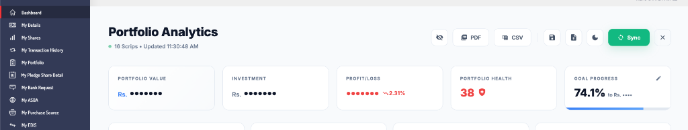

# Mero Share Integrated Stock Tracker

<p align="center">
  
</p>

<p align="center">
  <strong>Enhanced portfolio tracking for Mero Share Nepal</strong><br>
  Real-time insights, G/L calculations, sector analysis, and more.
</p>

<p align="center">
  
  
  
  
</p>

---

## ✨ Professional Features

### 📊 Advanced Analytics
- **🚀 Real-time Portfolio Dashboard** - Comprehensive view with instant P/L calculations.
- **🏭 Sector Profit Analysis** - Visualization showing which industries are driving your earnings.
- **📊 Health Score & Concentration** - Identify risk with automatic concentration alerts and portfolio health gauge.
- **🔔 Corporate Action Tracker** - Automated background monitoring for Dividends, Bonus, and Right shares via ShareSansar.

### 🛠️ Trading Tools
- **🧮 Profit Simulator (Exit Planner)** - Calculate net profit after NEPSE commission, SEBON fees, DP fees, and CGT.
- **📏 Position Sizing Calculator** - Built-in risk management tool to calculate optimal buy units based on your entry/stop-loss.
- **📉 WACC Simulator (Average Down)** - Plan your next buy with a simulator that accounts for multi-tier NEPSE fees.
- **📈 Nepsense Charting** - Quick access to technical charts on Nepsense.com for every scrip in your holdings.
- **🔔 Local Price Alerts** - Background monitoring and desktop notifications for your target prices.
- **🎁 Bonus Share Tracker** - Log pending bonus scrips and see your **Adjusted WACC** instantly.
- **📝 Script-Specific Notes** - Add custom reminders and strategies for every holding.

### 🕉️ Vedic & Lunar Analytics
- **🪐 Vimshottari Dasha Timeline** - Precise 120-year planetary cycle calculation from birth.
- **📈 Personalized Stock Guidance** - Multi-layered investment advice based on Lagna, Nakshatra, and real-time transits.
- **🌙 High-Precision Lunar Data** - Accurate Rashi, Nakshatra (with Pada), Tithi, and Vara calculations for Nepal.
- **✨ Cosmic Vibe Scoring** - Real-time mood indicators for every stock in your portfolio based on lunar alignments.

### ⚡ User Experience
- **📋 Export PDF & CSV** - Generate professional PDF reports or download raw CSV data for Excel analysis.
- **📂 Data Portability** - One-click JSON backup and restore for all your notes, alerts, and settings.
- **🕵️ Privacy Mode** - Hide sensitive numbers with one click for screen sharing.
- **🌙 Pro Dark Theme** - Sleek, terminal-grade interface designed for long trading sessions.
- **🔄 Smart Sync** - Seamless integration with MeroShare's own WACC and Portfolio data.

---

> [!IMPORTANT]
> **Prerequisite**: You must have completed **My Purchase Source** in MeroShare for all pending stocks to ensure accurate G/L and WACC calculations.

## 📦 Installation

### 🦊 Firefox
1. Download the `meroshare-analytics-v3.0.0.zip` from the latest release.
2. Go to `about:addons` in Firefox.
3. Click the gear icon (⚙️) and select **"Install Add-on From File..."**.

---

### 🌐 Microsoft Edge
1. Download or clone this repository.
2. Go to `edge://extensions/` in your address bar.
3. Enable "Developer mode" (toggle in bottom-left corner).
4. Click "Load unpacked" and select the extension folder.

---

### 🔵 Google Chrome
1. Download or clone this repository:
   ```bash
   git clone https://github.com/shadowmonarchftw-star/meroshare-analytics.git
   ```
2. **Rename** `manifest_chrome.json` to `manifest.json` (replacing the existing one).
3. Open Chrome and navigate to `chrome://extensions/`
4. Enable "Developer mode" (toggle in top-right corner).
5. Click "Load unpacked" and select the extension folder.

---

## 🚀 Usage

### 📸 Visual Overview



### Getting Started
1. Log in to [Mero Share](https://meroshare.cdsc.com.np)
2. Click on the **"Dashboard"** item in the main sidebar (it's the very first item).
3. The custom Integrated Analytics Dashboard will load automatically.
4. Hit the **Sync** button to gather your latest scrips and WACC data seamlessly.

> [!TIP]
> **Troubleshooting**: If the analytics dashboard doesn't load immediately or shows the original MeroShare view, simply **refresh the page**.

### Pro Investor Tips
- **Exit Planning**: Click the 🧮 icon on any stock to see your net profit *after* taxes and commissions before you sell.
- **Risk Management**: Use the **Size** button (📏) to calculate proper position sizing based on your allowed risk percentage.
- **Corporate Actions**: Look for **DIV** or **RIGHT** badges in your portfolio table. Click the 🔔 icon in the header for a detailed summary.
- **Average Down**: Use the **WACC icon** (📉) to see how buying more shares will affect your average price, including all hidden fees.
- **Technical Analysis**: Click the **Chart icon** (📈) to jump straight to Nepsense.com for detailed charting.
- **Bonus Credit**: Click the 🎁 icon to log pending shares from auctions or bonuses to see your **Adjusted WACC** immediately.
- **Price Alerts**: Set alerts via the 🔔 icon. The extension monitors prices in the background even when the dashboard is closed!
- **Data Privacy**: Click the 🕵️ visibility icon to mask your portfolio values instantly.

---

## 🔒 100% Privacy Guarantee

We take your financial privacy seriously. Unlike many other trackers, this extension is built on a **Zero-Server Architecture**:

- **Local Storage**: Your portfolio, notes, and alerts stay **strictly on your computer**.
- **No External Servers**: We have no database and no tracking services. Your data is never uploaded anywhere.
- **Open Source**: Review the code for yourself on GitHub to see exactly how your data is handled.
- **Safe Authentication**: Uses your existing Mero Share session—we never ask for or store your passwords.

For more details, read our full [Privacy Policy](PRIVACY_POLICY.md).

---

## 🛠️ Technical Details

### Permissions Used
| Permission | Purpose |
|------------|---------|
| `storage` | Persistent local storage for portfolio, alerts, and history |
| `alarms` | Background engine for periodic LTP updates & snapshots |
| `notifications` | Desktop alerts for price target triggers |

### Supported Sites
- `https://meroshare.cdsc.com.np/*`
- `https://www.sharesansar.com/*` (for corporate actions data)

---

## 🤝 Contributing

Contributions are welcome! Please feel free to submit issues and pull requests.

1. Fork the repository
2. Create your feature branch (`git checkout -b feature/AmazingFeature`)
3. Commit your changes (`git commit -m 'Add some AmazingFeature'`)
4. Push to the branch (`git push origin feature/AmazingFeature`)
5. Open a Pull Request

---

## 📄 License

This project is licensed under the MIT License - see the [LICENSE](LICENSE) file for details.

---

---

## ⚖️ Legal Disclaimer

**Mero Share Integrated Stock Tracker** is an open-source tool provided for educational and personal portfolio tracking purposes only.

1. **"As-Is" Basis**: This software is provided "as is" without any warranties.
2. **Financial Advice**: **NOT FINANCIAL ADVICE.** All trading involves risk. The author is not responsible for any financial losses.
3. **Astrology**: The "Vedic Jyotish" and "Cosmic Vibe" features are for **entertainment purposes only**.
4. **Forks**: We are not responsible for code or security in third-party versions/forks.

---

## 👨‍💻 Author

**shadowmonarchftw-star**

- GitHub: [@shadowmonarchftw-star](https://github.com/shadowmonarchftw-star)

---

<p align="center">
  Made with ❤️ for Nepali investors
</p>
